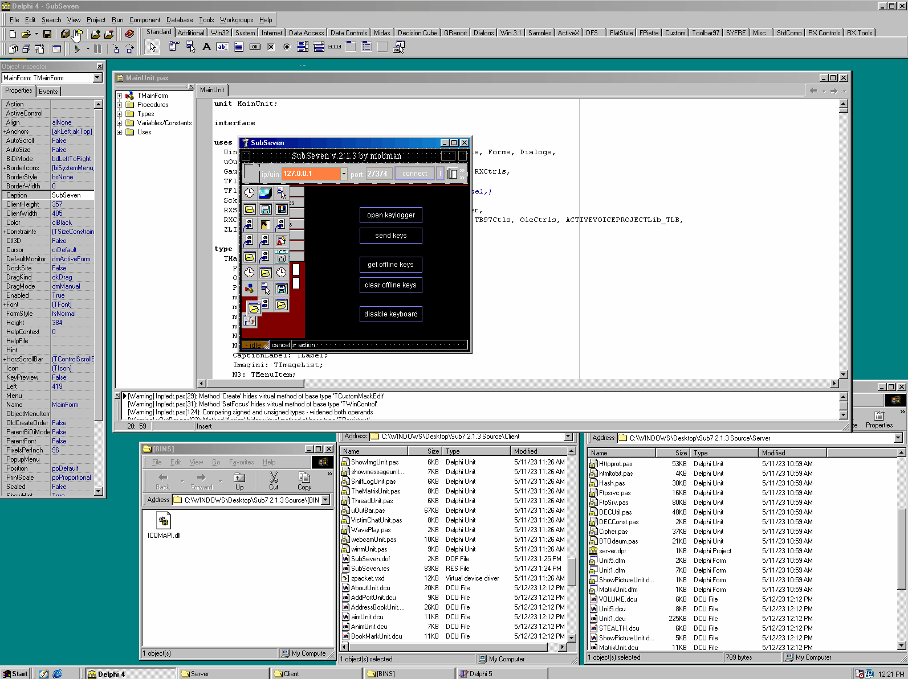

# Sub7
SubSeven was a backdoor program or R.A.T. (remote administration tool) written in Delphi by mobman, that allowed others to gain full access to Windows 9X systems through a network connection. This is the source code to **Sub7 2.1.2**, and released April 2000 right before the malicious HDDKiller batfile was added to the 2.1.3 BONUS edition. 
I recieved this source code directly from mobman after extensive OSINT within the past 5 years to find mobman, which i wrote about [::HERE::](https://www.illmob.org/notmymobman/). This source code was released to coincide with my talk at [BSidesCT](https://www.bsidesct.org/) 9/30/23. As of writing there were some Delphi4 components that were missing from the original files recieved. These will be released at a later date and is up to the end user to find and compile these properly. Compilation was achieved by making a Windows98 VM and using Delphi 4 to compile as seen below.

## History
Sub7 or SubSeven is a (RAT) Remote Access Trojan horse program originally released in 1999. Its name was derived by spelling NetBus backwards ("suBteN") and swapping "ten" with "seven" by a Romanian coder with the moniker '_mobman_'. 
It consisted of 3 different components: 
- Client (SubSeven.exe): GUI used to connect to the server over the network.
- Server (server.exe): The backdoor to run on the victim machine.
- EditServer (EditServer.exe): Edits the server with custom settings before deployment.

## Versions
I am only displaying the original versions made by mobman himself, not the ones coded by others 2.3.X.
- SubSeven 1.0
- SubSeven 1.1
- SubSeven 1.2
- SubSeven 1.3
- SubSeven 1.4
- SubSeven 1.5
- SubSeven 1.6
- SubSeven 1.7
- SubSeven 1.8
- SubSeven 1.9
- SubSeven Apocalypse
- SubSeven 2.0
- SubSeven 2.1.0
- SubSeven 2.1.1 Gold
- **SubSeven 2.1.2 Muie**
- SubSeven 2.1.3 Bonus
- SubSeven 2.1.4 DEFCON8
- SubSeven 2.1.4 Legends
- SubSeven 2.2.0 

## Thanks
mobman, Read101, and DarkCoderSc

## License

[MIT](https://choosealicense.com/licenses/mit/)

## Discord

Join:
[#SUB7](https://discord.gg/ZsTBNrU2R4)
